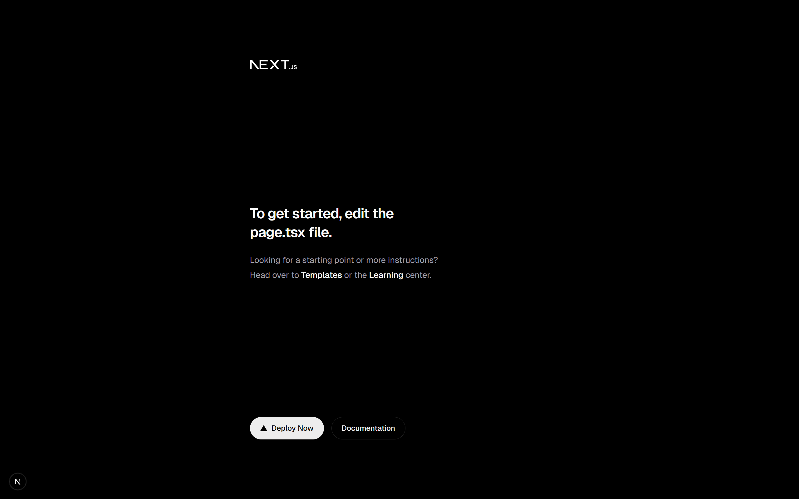

# S86-1225-Abyss_Watchers — Full-Stack Early Flood Warning System

Next.js + AWS + SafeShoreAzure | Real-Time Flood-Risk Visualization and Alerts

Abyss Watchers is a full-stack early flood-warning platform designed for districts vulnerable to seasonal flooding. Using open meteorological data, the system delivers real-time visualization, predictive risk analytics, and automated alerts. It is built with Next.js on the frontend and integrates AWS services with SafeShoreAzure capabilities for cloud reliability and scalability.

Project Overview

Flood-prone regions need rapid access to accurate weather intelligence. Abyss Watchers provides a unified dashboard that allows residents and authorities to monitor rainfall patterns, river levels, and storm indicators, helping them prepare and respond efficiently.

Key Features

Real-time weather and river-level monitoring using open meteorological APIs

Interactive dashboards featuring risk maps, heatmaps, and rainfall intensity graphs

Automated alert system delivering SMS, email, WhatsApp, and push notifications

Predictive flood modeling using historical data and cloud-based ML services

Cloud-native architecture using AWS Lambda, EC2, S3, DynamoDB, and Azure-based processing via SafeShoreAzure

Secure and scalable full-stack design with Next.js and Node.js backend services

Tech Stack

Frontend

Next.js

TailwindCSS

Leaflet or Mapbox for geospatial maps

Backend

Node.js / Express

Next.js API Routes

AWS Lambda for event triggers

Azure Functions for ML inference

Cloud Infrastructure

AWS S3, DynamoDB or RDS

Azure ML and Azure Maps

SafeShoreAzure routing and monitoring

SNS, SES, and WhatsApp Cloud API for alerts

Why This Project Matters

Early warnings significantly reduce the loss of life and property during flooding events. By combining open data, predictive modeling, and cloud-based alerting, Abyss Watchers helps local residents and authorities make timely decisions, plan evacuations, and prepare resources in advance.

Roadmap

Geo-fenced alert zones

Offline-first PWA support

Multi-language interface for local communities

Historical flood pattern visualizations

Admin dashboard for district-level control

Contributions

Contributions are welcome. Developers can assist with improving data processing pipelines, UI enhancements, predictive models, and cloud integration layers. Fork the repository, open an issue, or submit a pull request

**sprint-1: local-app-running.png**

